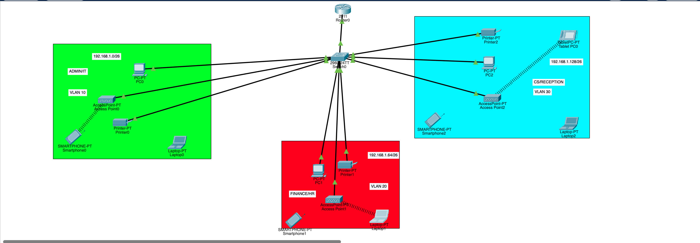

# Cisco VLan Network Design 

## Project Overview
Building a small network for a branch of a fast-growing company, segmented into three separate departments, each isolated on their own VLAN. The network was designed using a base network of 192.168.1.0, subnetted into /26 blocks to allocate a dedicated subnet per department. Each department has wireless access for its users, host devices are assigned IP addresses automatically via DHCP (Dynamic Host Configuration Protocol), and all devices are able to communicate with each other across VLANs.

## Network Requirements
- One router and one switch (Cisco)
- 3 departments each on a separate VLAN
- Wireless access per department
- DHCP for automatic IP assignment
- Inter-VLAN communication enabled

## Network Topology


### Admin/IT Department (VLAN 10)
**Network:** 192.168.1.0/26  
**Gateway:** 192.168.1.1

| Device | Description |
|--------|-------------|
| PC0 | Admin workstation |
| Access Point0 | Wireless access |
| Printer0 | Department printer |

### Finance/HR Department (VLAN 20)
**Network:** 192.168.1.64/26  
**Gateway:** 192.168.1.65

| Device | Description |
|--------|-------------|
| PC1 | Finance workstation |
| Access Point1 | Wireless access |
| Printer1 | Department printer |

### CS/Reception Department (VLAN 30)
**Network:** 192.168.1.128/26  
**Gateway:** 192.168.1.129

| Device | Description |
|--------|-------------|
| PC2 | Reception workstation |
| Access Point2 | Wireless access |
| Printer2 | Department printer |

### Equipment Used
- **Router:** Cisco 2911
- **Switch:** Cisco 2960-24TT

## Configuration
### Router Setup
```cisco
interface g0/0
 no shutdown
interface g0/0.10
 encapsulation dot1Q 10
 ip address 192.168.1.1 255.255.255.192
interface g0/0.20
 encapsulation dot1Q 20
 ip address 192.168.1.65 255.255.255.192
interface g0/0.30
 encapsulation dot1Q 30
 ip address 192.168.1.129 255.255.255.192
```

### Switch Setup
```cisco
! Create VLANs
vlan 10
 name ADMIN_IT
vlan 20
 name FINANCE_HR
vlan 30
 name CS_RECEPTION
! Configure access ports
interface range fa0/1-8
 switchport mode access
 switchport access vlan 10
! Configure trunk port to router
interface g0/1
 switchport mode trunk
```

### DHCP Configuration
```cisco
ip dhcp pool ADMIN_IT
 network 192.168.1.0 255.255.255.192
 default-router 192.168.1.1
ip dhcp pool FINANCE_HR
 network 192.168.1.64 255.255.255.192
 default-router 192.168.1.65
ip dhcp pool CS_RECEPTION
 network 192.168.1.128 255.255.255.192
 default-router 192.168.1.129
```

## Testing Results
- [x] Ping within ADMIN/IT department
- [x] Ping within FINANCE/HR department
- [x] Ping within CS/RECEPTION department
- [x] **Ping between all departments (inter-VLAN routing working)**
- [x] DHCP addresses assigned automatically to all hosts

## Skills Demonstrated
- VLAN configuration and segmentation
- Inter-VLAN routing
- Subnetting (/26)
- DHCP configuration
- Wireless access point integration
- Trunk and access port configuration

## Tools Used
- Cisco Packet Tracer
- Cisco IOS

## Project Files
- [`topology.pkt`](Vlantopology.pkt) - Packet Tracer simulation file
- [`configs/`](configs/) - Device configuration files
- [`topology.png`](topology.png) - Network topology diagram
